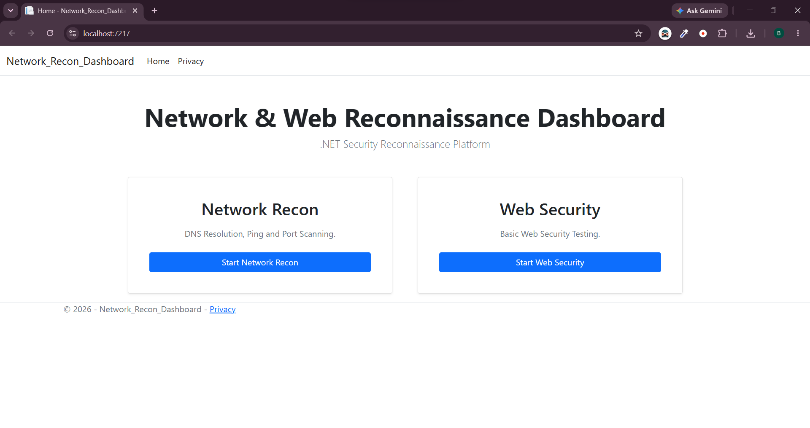

إليك **الكود الكامل والجاهز للملف بالكامل**، تم تدارك الأجزاء الناقصة وإضافة باقي الأقسام مثل الصور، الهيكلية (Project Structure)، خطوات العمل (Workflows)، مفاهيم الـ CEH، التنبيه القانوني، والـ Demo Video.

كل ما عليكِ فعله هو نسخ هذا النص بالكامل كما هو، ثم لصقه داخل ملف `README.md`:

```markdown
# 🔐 Network & Web Reconnaissance Dashboard

An enterprise-ready **Security Dashboard** developed using **ASP.NET Core MVC** and **C#**, integrating practical **Certified Ethical Hacker (CEH)** footprinting and web vulnerability techniques into a centralized management interface.

---

## 📸 Dashboard Overview

### 🏠 Main Interface


---

## 🎯 Project Objective

The primary objective of this dashboard is to bridge the gap between theoretical **Ethical Hacking concepts** and practical **Web Application Development**. It serves as an automated footprinting tool for network reconnaissance and lightweight web security assessment within controlled environments.

---

## 🚀 Key Features

### 🌐 Network Reconnaissance
- **Host Discovery**: ICMP Ping testing to identify active hosts.
- **DNS Resolution**: Forward and reverse DNS lookups.
- **TCP Port Scanner**: Efficient multi-threaded scanning of target ports.
- **Service & Banner Grabbing**: Identification of running services and exposed banners on open ports.
- **Report Generation**: Exporting network reconnaissance results into printable summaries.

### 🛡️ Web Security Testing
- **HTTP Header Inspection**: Detection of web server headers and server configuration disclosures.
- **Status Code Mapping**: Analysis of HTTP response codes and server behaviors.
- **Reflected Input Check**: Basic reflection detection mechanisms for XSS testing.
- **Security Training Lab**: Embedded local test targets for controlled security evaluation.

---

## 🛠️ Tech Stack & Dependencies

- **Backend**: C# | .NET Core MVC | System.Net (Sockets, Sockets.Ping, DNS)
- **Frontend**: HTML5 | CSS3 | JavaScript | Bootstrap 5
- **Architecture**: Repository / Service Layer Pattern
- **Development Environment**: Visual Studio / Windsurf IDE

---

## 🏗️ Project Architecture

```text
       ┌────────────────────────┐
       │   User / Web Browser   │
       └───────────┬────────────┘
                   │
                   ▼
       ┌────────────────────────┐
       │   Controllers Layer    │
       │ (Recon / WebSecurity)  │
       └───────────┬────────────┘
                   │
                   ▼
       ┌────────────────────────┐
       │     Services Layer     │
       │(ReconService / XssSvc) │
       └───────────┬────────────┘
                   │
        ┌──────────┴──────────┐
        ▼                     ▼
┌───────────────┐     ┌───────────────┐
│ Network Target│     │  Web Target   │
│ (TCP/ICMP/DNS)│     │  (HTTP / Web) │
└───────────────┘     └───────────────┘

```

---

## 📂 Project Structure

```text
Network-Recon-Dashboard
│
├── Controllers
│   ├── ReconController.cs
│   └── WebSecurityController.cs
│
├── Models
│   ├── ReconViewModel.cs
│   └── PortResult.cs
│
├── Services
│   ├── ReconService.cs
│   └── XssService.cs
│
├── Views
│   ├── Home
│   ├── Recon
│   └── WebSecurity
│
├── screenshots
│   └── homePage.png
│
├── wwwroot
│   ├── css
│   └── js
│
├── Program.cs
└── README.md

```

---

## 🔍 Workflows

### 1. Network Recon Workflow

1. User enters a hostname or IP address.
2. `ReconService` performs a DNS lookup to resolve the IP address.
3. Ping is utilized for host vitality discovery.
4. Target TCP ports are scanned concurrently.
5. Open ports trigger service banner requests.
6. Aggregated results are displayed on the dashboard.

### 2. Web Security Workflow

1. User submits a web target URL.
2. `XssService` executes HTTP requests to analyze response headers.
3. Server metadata and HTTP status codes are extracted.
4. Input strings are evaluated for basic reflected input behavior.

---

## 🎥 Project Demonstration

Watch a video walkthrough of the dashboard in action:

👉 **[Watch Project Demo Video]([https://www.google.com/search?q=YOUR_VIDEO_LINK_HERE](https://drive.google.com/file/d/1hwAk4QvU1BBC6UudNsjyQs9YMV4nAaY1/view?usp=drive_link))**

---

## 📚 CEH Concepts Applied

* **Footprinting & Reconnaissance**: Target information gathering and DNS lookups.
* **Scanning Networks**: Host discovery via ICMP and port scanning via TCP sockets.
* **Enumeration**: Service name detection and banner grabbing.
* **Web Application Hacking**: HTTP header disclosures and reflected XSS testing.

---

## ⚠️ Disclaimer

This project is created strictly for **educational and authorized testing purposes** as part of security training. Do not use this tool against any system without explicit authorization.

---

## 👩‍💻 Author

**Basant Ali**

*Full Stack.Net Web Developer*

```

```
