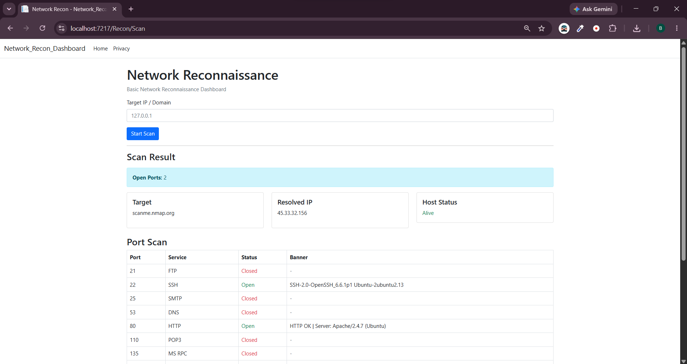
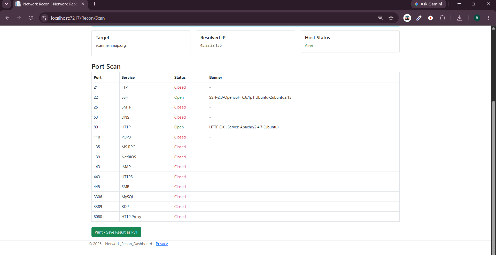
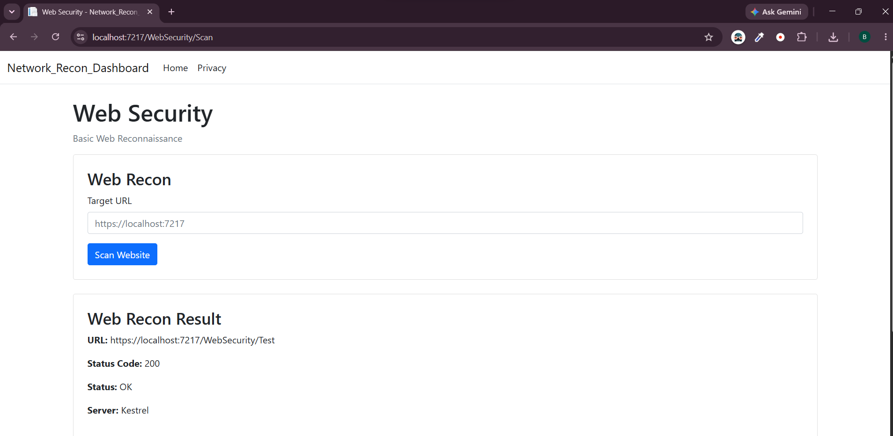

# 🔐 Network & Web Reconnaissance Dashboard

A .NET-based security dashboard developed as part of my CEH training.

The project combines basic Network Reconnaissance and Web Security testing into one simple dashboard.

---

## 📸 Project Screenshots

### 🏠 Dashboard


### 🌐 Network Reconnaissance



### 🔎 Scan Results



### 🛡️ Web Security



---

## 🎯 Project Objective

The main goal of this project is to apply basic CEH concepts in a practical .NET MVC application.

The dashboard helps perform basic reconnaissance and web security checks in a controlled environment.

---

## 🚀 Features

### Network Reconnaissance

- DNS Resolution
- Host Discovery using Ping
- TCP Port Scanning
- Common Port Detection
- Basic Service Detection
- Basic Banner Grabbing
- Scan Result Dashboard
- Print / Save Scan Results as PDF

### Web Security

- HTTP Status Code Detection
- Server Header Detection
- Basic Reflected XSS Testing
- Local XSS Training Page

---

## 🛠️ Technologies Used

- C#
- ASP.NET Core MVC
- HTML
- CSS
- Bootstrap
- TCP
- HTTP
- DNS
- ICMP

---

## 🏗️ Project Architecture

The project follows the MVC architecture with a separate Service Layer.

```text
User
  ↓
View
  ↓
Controller
  ↓
Service
  ↓
Network / Web Target
  ↓
Results
  ↓
View
